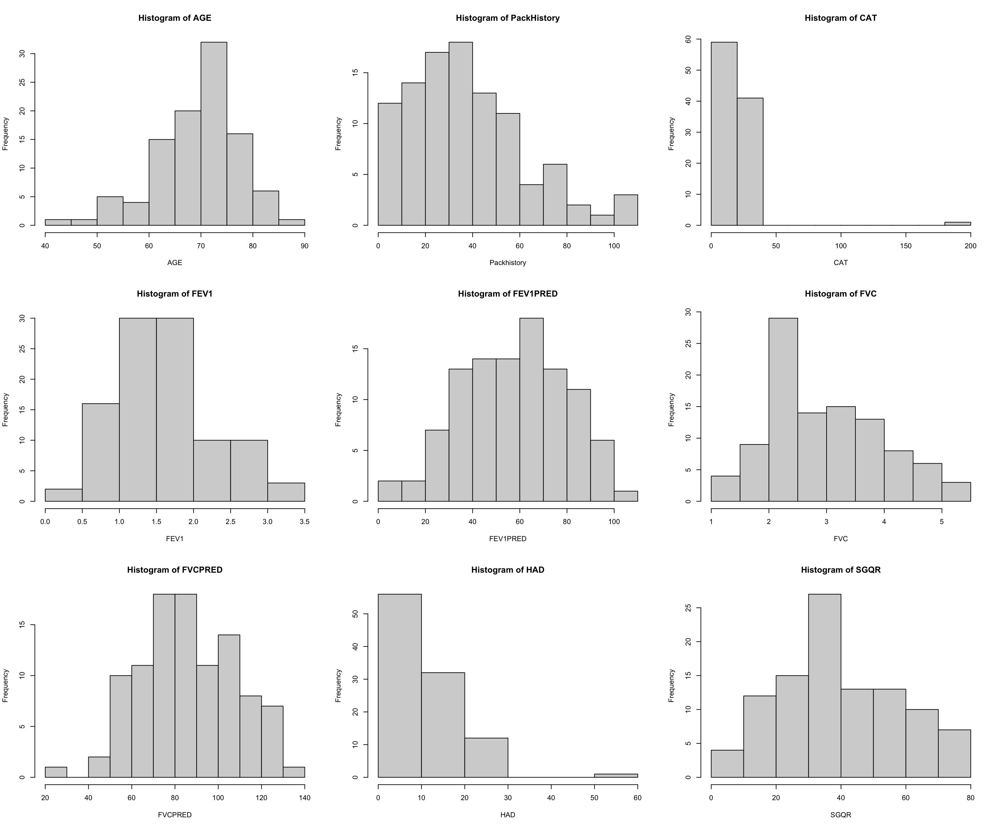
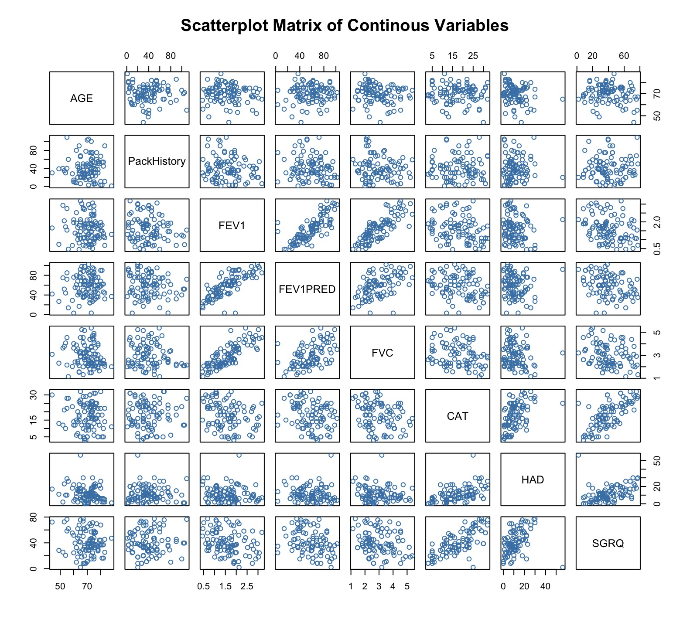
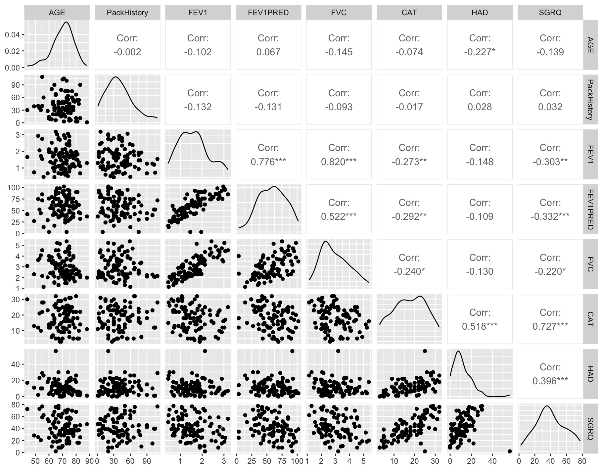
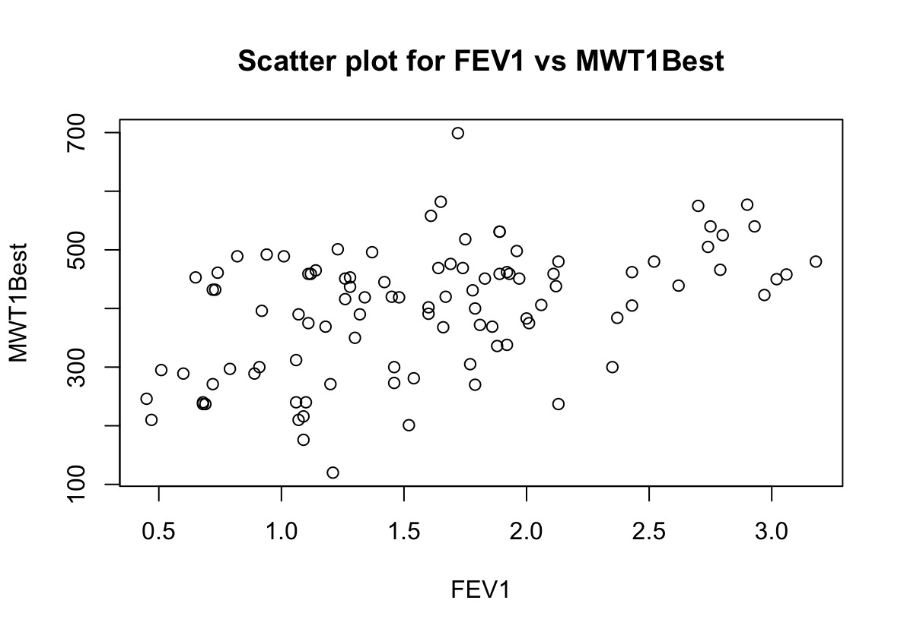
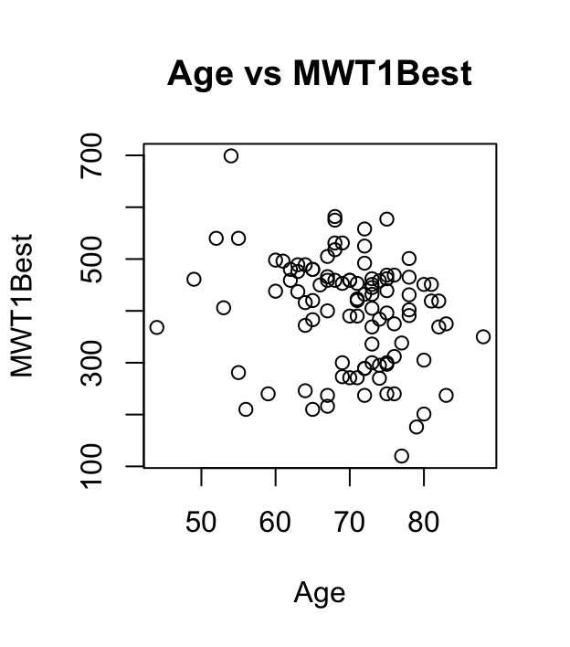
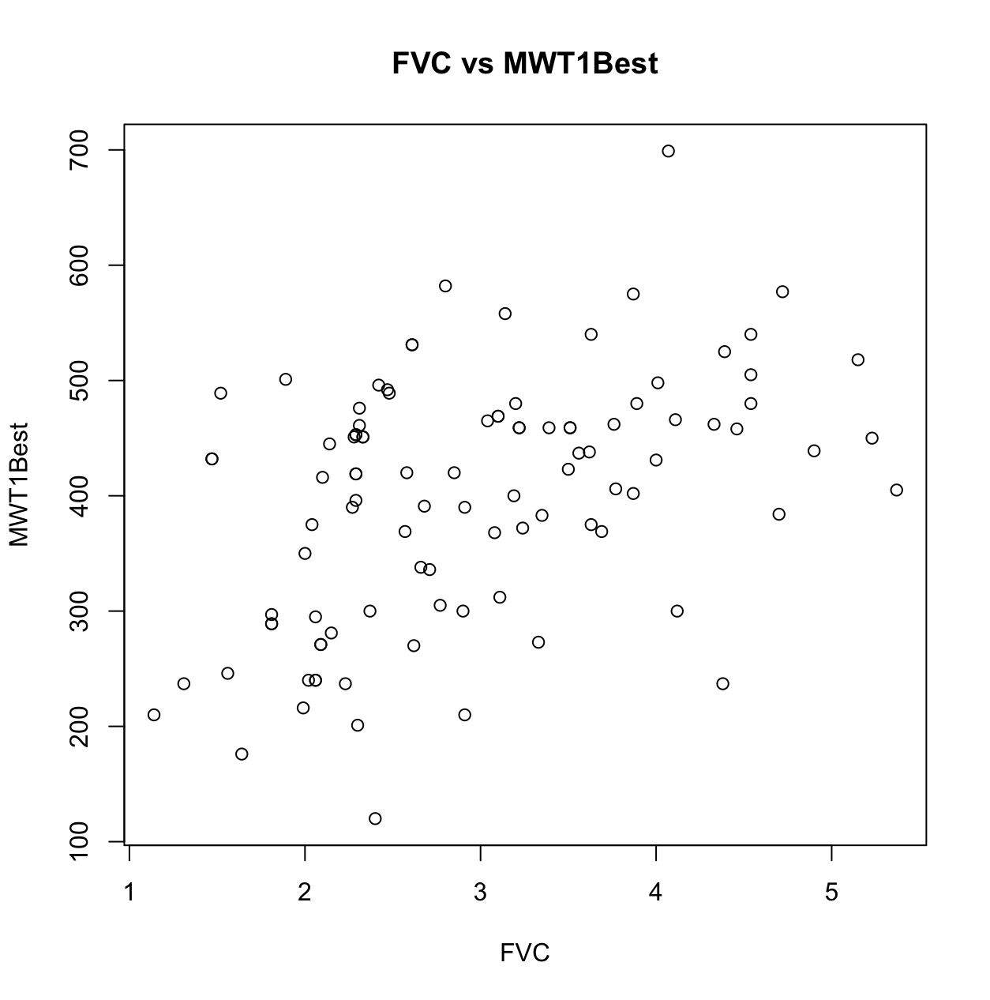
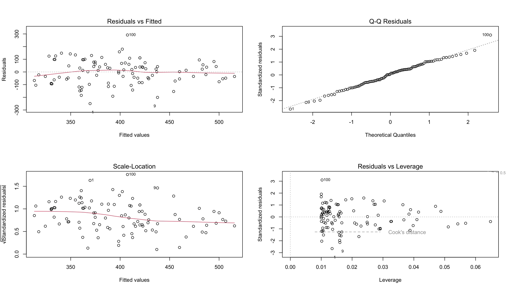
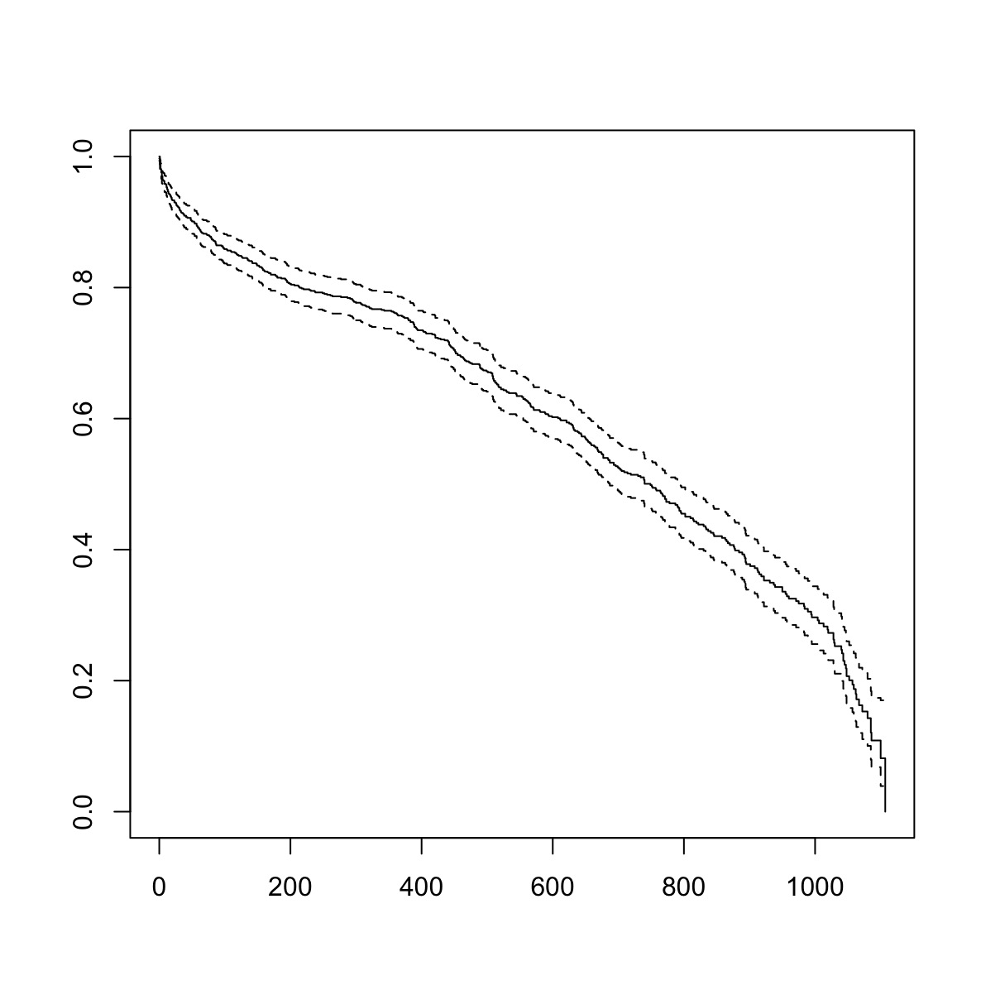

# R for Statistics — Coursera Learning Portfolio

This repository contains R scripts I wrote while completing a statistics course on Coursera. Each script focuses on a distinct set of analytical techniques applied to real-world-style datasets in epidemiology and clinical research. The goal is to document my learning progression from basic data exploration through to survival analysis and Cox regression.

---

## Repository Structure

```
.
├── graphs/
│   ├── 01_histogram_variables.jpeg
│   ├── 02_scatterplot_matrix.jpeg
│   ├── 03_ggpairs_correlations.jpeg
│   ├── 04_scatter_FEV1_vs_MWT1Best.jpeg
│   ├── 05_scatter_Age_vs_MWT1Best.jpeg
│   ├── 06_scatter_FVC_vs_MWT1Best.jpeg
│   ├── 07_regression_diagnostics.jpeg
│   └── 08_KM_survival_curve.jpeg
├── 01_intro_data_exploration.R       # EDA, hypothesis tests
├── 02_linear_regression_COPD.R       # Simple & multiple linear regression
├── 03_model_building_COPD.R          # Multivariable model building & diagnostics
├── 04_logistic_regression_diabetes.R # Logistic regression & model fit assessment
├── 05_survival_analysis_KM_plots.R   # Kaplan-Meier curves & log-rank test
├── 06_cox_proportional_hazards.R     # Cox regression & PH assumption testing
└── README.md
```

> **Note on datasets:** The original CSV files are not included in this repository as they were provided via the Coursera course platform. Update the file paths at the top of each script to point to your local copies.

---

## Graphs

| # | Graph | Script |
|---|-------|--------|
| 01 |  | Script 03 — 9-panel histograms of all COPD variables |
| 02 |  | Script 03 — Base R pairs plot |
| 03 |  | Script 03 — Enhanced correlation matrix with coefficients |
| 04 |  | Script 02 — Moderate positive correlation |
| 05 |  | Script 02 — Weak negative correlation |
| 06 |  | Script 02 — FVC explored as predictor |
| 07 |  | Script 02 — Regression assumption check (4-panel) |
| 08 |  | Script 05 — Overall Kaplan-Meier survival curve |

---

## Datasets Used

| Script | Dataset | Description |
|--------|---------|-------------|
| 01 | `cancer_survey.csv` | Cancer risk survey: diet, BMI, smoking, demographics |
| 02–03 | `COPD_student_dataset.csv` | COPD patient cohort with lung function and walk test data |
| 04 | `diabetes_dataset.csv` | Cross-sectional diabetes survey with metabolic and demographic variables |
| 05–06 | `simulated_HF_mortality.csv` | 1,000 simulated heart failure patients with survival follow-up |

---

## Scripts — Skills Summary

### 01 · Introduction to Data Exploration
**File:** `01_intro_data_exploration.R`

First contact with R for epidemiological data analysis. This script covers the essentials of importing data, summarising variables, creating derived variables, and running basic inferential tests.

Key techniques:
- `read.csv()`, `table()`, `summary()`, `hist()`
- Creating new variables with `ifelse()` and arithmetic
- Base R and ggplot2 histograms
- Chi-square test (`chisq.test`) for association between categorical variables
- Independent samples t-test (`t.test`) — Welch and equal-variance versions
- One-sample t-test against a known reference value

---

### 02 · Simple and Multiple Linear Regression (COPD)
**File:** `02_linear_regression_COPD.R`

Uses the COPD dataset to model 6-minute walk distance (MWT1Best) as a function of lung function (FEV1), age, and forced vital capacity (FVC).

Key techniques:
- Outlier inspection with `subset()`
- Pearson and Spearman correlation (`cor.test`)
- Simple linear regression `lm(y ~ x)`
- Multiple linear regression `lm(y ~ x1 + x2 + ...)`
- Regression diagnostic plots (residuals vs fitted, Q-Q, scale-location, leverage)
- Interpreting R², adjusted R², F-statistic, and 95% confidence intervals
- `relevel()` to change the reference category for factor predictors
- Creating a composite comorbidity variable

---

### 03 · Model Building — Best Practices (COPD)
**File:** `03_model_building_COPD.R`

Demonstrates a structured approach to building a multivariable model: inspect each variable, examine predictor relationships, screen with univariable models, then build the final model.

Key techniques:
- `Hmisc::describe()` for detailed variable summaries
- `gmodels::CrossTable()` for categorical variable cross-tabulations
- Spearman correlation matrix (`cor()` with `method = "spearman"`)
- Base R `pairs()` and `GGally::ggpairs()` scatterplot matrices
- Variance Inflation Factor (`mctest::imcdiag`) to detect multicollinearity
- Interaction terms: manual product and inline `factor(A) * factor(B)` syntax
- Marginal predicted values using the `prediction` package

---

### 04 · Logistic Regression (Diabetes)
**File:** `04_logistic_regression_diabetes.R`

Models the binary outcome of diabetes diagnosis using demographic and metabolic predictors. Covers the full workflow from variable preparation to model fit assessment.

Key techniques:
- BMI calculation from imperial units (height in inches, weight in lbs)
- Categorising continuous variables into clinically meaningful groups
- Log-odds plots to check the linearity assumption for continuous predictors
- `glm()` with `family = binomial(link = "logit")`
- Exponentiating coefficients to obtain odds ratios (`exp(coef())`)
- `relevel()` to set the reference category
- McFadden's pseudo-R² for overall model fit
- C-statistic / AUC (`DescTools::Cstat`)
- Hosmer-Lemeshow goodness-of-fit test (`ResourceSelection::hoslem.test`)
- Likelihood ratio test (`anova(..., test = "Chisq")`)
- Backward selection rationale and collinearity check

---

### 05 · Kaplan-Meier Survival Analysis
**File:** `05_survival_analysis_KM_plots.R`

Introduces time-to-event analysis using a simulated heart failure cohort. KM curves visualise survival probability over time; the log-rank test compares groups.

Key techniques:
- `survival::Surv(time, event)` survival object
- `survfit()` for KM estimates
- `plot()` for KM curves; customised axes, colours, and legend
- `summary(km_fit, times = ...)` to extract survival at specific time points
- Stratified KM curves by gender
- Log-rank test `survdiff(..., rho = 0)`
- Dichotomising a continuous variable (age ≥65 vs <65) for group comparison

---

### 06 · Cox Proportional Hazards Regression
**File:** `06_cox_proportional_hazards.R`

Extends survival analysis to multivariable settings using the semi-parametric Cox model. Covers the critical proportional hazards assumption and how to diagnose and handle violations.

Key techniques:
- `survival::coxph()` for Cox regression
- Interpreting log hazard ratios, hazard ratios, and the concordance statistic
- Multiple covariate Cox model
- `cox.zph()` Schoenfeld residual test for the proportional hazards assumption
- Schoenfeld residual plots
- `survminer::ggcoxdiagnostics()` dfbeta influence plots
- Time-varying covariates using `tt()` for PH violations

---

## Skills Progression

```
Data import & wrangling
        ↓
Descriptive statistics & visualisation
        ↓
Hypothesis testing (chi-square, t-test)
        ↓
Simple linear regression
        ↓
Multiple linear regression + model diagnostics
        ↓
Logistic regression (binary outcomes) + model fit
        ↓
Survival analysis — Kaplan-Meier + log-rank
        ↓
Cox proportional hazards regression
```

---

## Packages Used

| Package | Purpose |
|---------|---------|
| `ggplot2` | Data visualisation |
| `GGally` | Enhanced scatterplot matrices (`ggpairs`) |
| `Hmisc` | Rich variable summaries (`describe`) |
| `gmodels` | Cross-tabulations (`CrossTable`) |
| `mctest` | Multicollinearity diagnostics (VIF) |
| `prediction` | Marginal predicted values |
| `DescTools` | C-statistic (AUC) |
| `ResourceSelection` | Hosmer-Lemeshow test |
| `survival` | Core survival analysis (`Surv`, `survfit`, `coxph`) |
| `survminer` | Visualisation of survival objects |

---

## How to Run

1. Clone or download this repository.
2. Obtain the course datasets from your Coursera course materials.
3. Place the CSV files in a `data/` subfolder (or update the paths in each script).
4. Open each script in RStudio and run section by section.

---

*Learning initiative — Pinkesh Patel | 2026*
